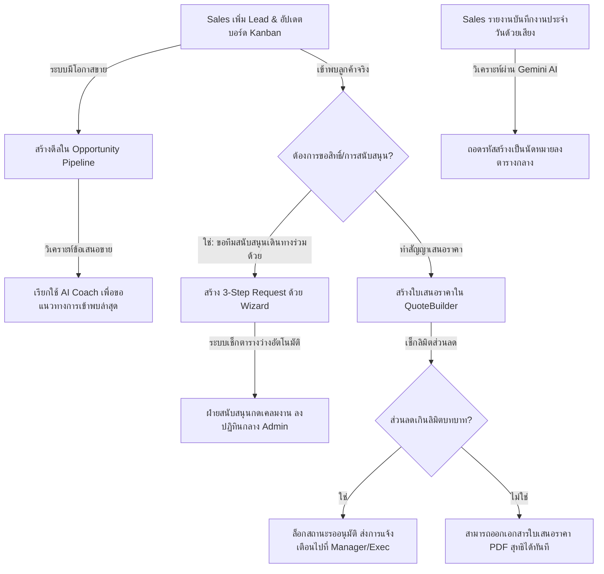

# 🏗️ แผนโครงสร้างสถาปัตยกรรมและโรดแมปการพัฒนา (System Architecture & Development Roadmap)
**โครงการ:** NEXTGEN Sale & Support (Enterprise CRM & ERP)  
**เวอร์ชันแนวคิด:** v2.0 (อ้างอิงโครงสร้างสถาปัตยกรรมระดับ Production จาก Nextopia)

เอกสารฉบับนี้ทำการวิเคราะห์ระบบเดิมจากไฟล์ตัวอย่างต้นแบบ (`NEXTGEN-Sale-Support-LATEST.html`) และทำการออกแบบโครงสร้างสถาปัตยกรรมใหม่ทั้งหมด โดยแยกส่วนเป็น **Frontend** และ **Backend** รวมถึงการออกแบบฐานข้อมูล (Database Schema) และขั้นตอนการทำงานอย่างเป็นระบบ เพื่อเตรียมพร้อมสำหรับการลงมือพัฒนาจริงโดยไม่ต้องเขียนโค้ดลงระบบในขั้นตอนนี้

---

## 📌 1. การวิเคราะห์ระบบเดิม (System Analysis & Migration Blueprint)

ระบบเดิมเป็นระบบบริหารงานขายและสนับสนุน (CRM & Support ERP) ที่ทำงานแบบ Single Page Application (SPA) ในไฟล์ HTML เดี่ยว โดยเก็บข้อมูลทั้งหมดไว้ใน `localStorage` และจำลองระบบ (Simulation) การทำงานของ AI และสิทธิ์การเข้าถึง หน้าที่หลักของเราคือการย้ายระบบนี้ขึ้นมาเป็นเว็บแอปพลิเคชันระดับองค์กรที่แท้จริง

### เทคโนโลยีที่เลือกใช้ (ตามพิมพ์เขียวของ Nextopia):
*   **Frontend**: React + TypeScript + Vite + Tailwind CSS + TanStack Router (File-based Routing สำหรับการจัดการสิทธิ์และโครงสร้าง Layout ที่ซับซ้อน)
*   **Backend**: Node.js + Express + TypeScript + MongoDB (ผ่านคอลเลกชันแบบ Native Driver ที่มีโครงสร้าง Type-safe)
*   **AI Service**: Gemini API สำหรับระบบ **AI Coach** (ให้คำแนะนำการขายรายโรงเรียน) และ **AI Conversational Logger** (แปลงเสียง/ข้อความสนทนาเป็นภารกิจและนัดหมายอัตโนมัติ)

---

## 🗂️ 2. โครงสร้างโฟลเดอร์ระบบ (Folder Directory Structure)

การจัดวางโฟลเดอร์จะถอดแบบโครงสร้างประสิทธิภาพสูงของ Nextopia เพื่อแยกความรับผิดชอบอย่างชัดเจน (Separation of Concerns):

```text
sell-nextgen/
├── backend/                       # รหัสฝั่ง Server (Node.js/Express/TypeScript)
│   ├── src/
│   │   ├── server.ts              # จุดเริ่มต้นการรัน Server
│   │   ├── app.ts                 # ตั้งค่า Express, Middleware และ Routes
│   │   ├── config/                # การเชื่อมต่อฐานข้อมูลและการตั้งค่าภายนอก
│   │   │   ├── mongodb.ts         # เชื่อมต่อ MongoDB Client
│   │   │   └── gemini.ts          # ตั้งค่า Google Generative AI Client
│   │   ├── models/
│   │   │   └── db.ts              # คอลเลกชันหลักและการจัดกลุ่มโมเดล (Users, Leads, Tasks, etc.)
│   │   ├── controllers/           # ตรรกะทางธุรกิจ (Business Logic) ของแต่ละโมดูล
│   │   │   ├── auth.controller.ts
│   │   │   ├── user.controller.ts
│   │   │   ├── lead.controller.ts
│   │   │   ├── opportunity.controller.ts
│   │   │   ├── task.controller.ts
│   │   │   ├── quote.controller.ts
│   │   │   ├── request.controller.ts
│   │   │   ├── product.controller.ts
│   │   │   └── ai.controller.ts
│   │   ├── services/              # บริการเสริมและฟังก์ชันทำงานเบื้องหลัง
│   │   │   ├── ai.service.ts      # ประมวลผลร่วมกับ Gemini API (AI Coach & AI Logger)
│   │   │   └── notification.service.ts # ระบบแจ้งเตือนกลาง (Badge & Bell)
│   │   ├── middlewares/           # ตัวกรองคำขอ (Request Interceptors)
│   │   │   ├── auth.middleware.ts # ตรวจสอบ Token และสิทธิ์/Rank (Rank 1-5)
│   │   │   └── error.middleware.ts
│   │   ├── types/
│   │   │   └── index.ts           # โครงสร้าง Type ข้อมูลฝั่ง Backend
│   │   └── utils/
│   │       └── helpers.ts
│   ├── tsconfig.json
│   └── package.json
│
├── frontend/                      # รหัสฝั่ง Client (Vite/React/TypeScript)
│   ├── src/
│   │   ├── main.tsx               # จุดเริ่มต้นฝั่ง React
│   │   ├── index.css              # ระบบดีไซน์และ Vanilla CSS/Tailwind CSS
│   │   ├── routeTree.gen.ts       # ไฟล์ Route ที่สร้างอัตโนมัติโดย TanStack Router
│   │   ├── routes/                # ระบบ File-based Routing
│   │   │   ├── __root.tsx         # โครงสร้างหลัก (Sidebar, Header, Bell Notifications)
│   │   │   ├── index.tsx          # หน้าแรก (ตรวจสอบการล็อกอิน)
│   │   │   ├── login.tsx          # หน้าจอล็อกอินและสลับบัญชีด่วน (Simulation)
│   │   │   ├── dashboard.tsx      # แดชบอร์ดสรุปยอดขายและกิจกรรมตามสิทธิ์
│   │   │   ├── pipeline.tsx       # หน้าจอ Opportunity Pipeline (Kanban Board)
│   │   │   ├── team-overview.tsx  # หน้าจอภาพรวมทีมสำหรับ Manager/Exec
│   │   │   ├── reports.tsx        # รายงานกิจกรรมย้อนหลัง
│   │   │   ├── calendar.tsx       # ปฏิทินกลาง (สลับมุมมอง รายเดือน/สัปดาห์/วัน)
│   │   │   ├── ai-logger.tsx      # หน้าจอ AI บันทึกกิจกรรมด้วยการสนทนา
│   │   │   ├── leads/             # โมดูล Leads & โรงเรียน
│   │   │   │   ├── index.tsx      # รายการ Leads, ตัวกรอง Zone, Status, Score
│   │   │   │   └── $leadId.tsx    # รายละเอียดโรงเรียน, ผู้ติดต่อ, แท็บ AI Coach
│   │   │   ├── tasks/             # โมดูลงานและนัดหมาย
│   │   │   │   ├── index.tsx      # ตารางงานส่วนตัวและปุ่มเชิญเพื่อนร่วมงาน
│   │   │   ├── quotes/            # โมดูลการเงิน (ใบเสนอราคา)
│   │   │   │   ├── index.tsx      # รายการใบเสนอราคาและสถานะอนุมัติ
│   │   │   │   └── build.tsx      # ระบบสร้างใบเสนอราคา (QuoteBuilder + Limit Check)
│   │   │   ├── requests/          # โมดูลระบบคำขอ (Request System)
│   │   │   │   ├── index.tsx      # รายการคำขอที่ route มาแผนกตัวเอง การกดเคลมงาน/ส่งต่อ
│   │   │   │   └── create.tsx     # ฟอร์มสร้างคำขอ 3 ขั้นตอน (พร้อม Availability Check)
│   │   │   ├── products.tsx       # ตั้งค่าสินค้าและราคา (Manager/Exec เท่านั้น)
│   │   │   ├── discount-settings.tsx # ตั้งค่าวงเงินส่วนลดตามบทบาทและรายบุคคล
│   │   │   └── admin/             # เมนูเฉพาะผู้บริหาร (Exec/Exec_asst)
│   │   │       ├── users.tsx      # จัดการผู้ใช้งาน สิทธิ์ และการสร้าง Role ใหม่
│   │   │       └── calendar.tsx   # ปฏิทินงานหน่วยสนับสนุนขององค์กร (Admin Calendar)
│   │   ├── components/
│   │   │   ├── ui/                # คอมโพเนนต์พื้นฐานแบบพรีเมียม (Buttons, Modals, Inputs, Badges)
│   │   │   ├── layout/            # คอมโพเนนต์เลย์เอาต์ (Sidebar, NotificationBell)
│   │   │   └── modules/           # คอมโพเนนต์เฉพาะของแต่ละฟีเจอร์
│   │   │       ├── leads/         # LeadCard, ContactList, AICoachPanel
│   │   │       ├── pipeline/      # KanbanColumn, OpportunityCard
│   │   │       ├── tasks/         # InviteBanner, TimeConflictWidget
│   │   │       ├── quotes/        # QuoteBuilderForm, PDFExporter
│   │   │       └── requests/      # StepIndicator, AvailabilityCalendar
│   │   ├── hooks/                 # Custom Hooks เช่น useAuth, useNotification
│   │   ├── services/              # API Clients เชื่อมต่อกับ Backend (axios/fetch)
│   │   │   ├── api.ts             # ตัวเชื่อมต่อหลักพร้อมแนบ Token
│   │   │   ├── auth.ts
│   │   │   ├── lead.ts
│   │   │   ├── task.ts
│   │   │   ├── quote.ts
│   │   │   ├── request.ts
│   │   │   └── ai.ts
│   │   ├── types/
│   │   │   └── index.ts           # โครงสร้าง Type ข้อมูลฝั่ง Frontend
│   │   └── utils/                 # ฟังก์ชันช่วยเหลือ เช่น ตัวจัดรูปแบบวันที่และเงิน
│   ├── vite.config.ts
│   ├── tailwind.config.js
│   └── package.json
```

---

## 🗃️ 3. การออกแบบโมเดลข้อมูลและฐานข้อมูล (Database Schema Design)

เพื่อรองรับระบบงานจริง ข้อมูลที่เดิมถูกเก็บใน `localStorage` จะถูกออกแบบเป็นโครงสร้างเอกสาร (Document Schemas) บน MongoDB ดังนี้:

### 1. คอลเลกชัน `users` (ข้อมูลพนักงานและการจัดการสิทธิ์)
```typescript
interface User {
  _id: string;             // รหัสผู้ใช้
  name: string;            // ชื่อ-นามสกุล
  email: string;           // อีเมลหลัก (ใช้ล็อกอิน)
  passwordHash: string;    // รหัสผ่านที่แฮชแล้ว
  roleId: string;          // ลิงก์ไปยังคอลเลกชัน roles
  rank: number;            // ลำดับขั้นสิทธิ์ (1: Admin/Finance/Academic/Prod, 3: Sales, 3.5: Manager, 4: Exec_asst, 5: Exec)
  zone?: string;           // เขตพื้นที่รับผิดชอบ (เช่น ภาคเหนือ, ภาคใต้) - เฉพาะ Sales
  avatarUrl?: string;      // รูปภาพโปรไฟล์
  createdAt: Date;
  updatedAt: Date;
}
```

### 2. คอลเลกชัน `roles` (บทบาทและตารางสิทธิ์การใช้งาน)
```typescript
interface Role {
  _id: string;
  name: string;            // ชื่อบทบาท (เช่น Sales, Sales Manager, Executive)
  rank: number;            // ระดับพลังสิทธิ์การอนุมัติ/สั่งงาน
  color: string;           // สีแสดงผล (เช่น #EF4444)
  permissions: {
    viewDashboard: boolean;
    manageLeads: boolean;
    managePipeline: boolean;
    manageTasks: boolean;
    useAIChat: boolean;
    viewTeamOverview: boolean;
    manageProducts: boolean;
    manageDiscounts: boolean;
    manageUsersAndRoles: boolean;
    editAdminCalendar: boolean;
    manageQuotes: boolean;
    approveRequests: boolean;
  };
  isSystemRole: boolean;   // ป้องกันการลบข้อมูลระบบหลัก
}
```

### 3. คอลเลกชัน `leads` (โรงเรียนและผู้ติดต่อ)
```typescript
interface Lead {
  _id: string;
  schoolName: string;      // ชื่อโรงเรียน
  address: string;
  zone: string;            // ภาค/เขตพื้นที่
  status: 'Cold' | 'Warm' | 'Hot' | 'Customer';
  score: number;           // คะแนนความน่าจะเป็นในการปิดการขาย (1-100)
  contacts: Array<{
    name: string;          // ชื่อผู้ติดต่อ (เช่น ครูแอน, ผอ.สมชาย)
    position: string;      // ตำแหน่ง (เช่น หัวหน้าหมวดวิชาการ)
    phone: string;
    email?: string;
  }>;
  assignedTo: string;      // รหัสผู้ใช้ (User ID ของ Sales ที่ดูแล)
  notes: Array<{
    author: string;        // ชื่อผู้บันทึก
    content: string;
    createdAt: Date;
  }>;
  createdAt: Date;
  updatedAt: Date;
}
```

### 4. คอลเลกชัน `opportunities` (ท่อโอกาสทางการขาย)
```typescript
interface Opportunity {
  _id: string;
  leadId: string;          // ลิงก์ไปยัง Lead (โรงเรียน)
  title: string;           // ชื่องานเสนอขาย (เช่น โครงการปรับปรุงห้องเรียนอัจฉริยะ)
  stage: 'Qualified' | 'Proposal' | 'Demo' | 'Negotiation' | 'Won' | 'Lost';
  value: number;           // มูลค่าดีล (บาท)
  closeDate: Date;         // วันที่คาดว่าจะปิดการขาย
  assignedTo: string;      // รหัสผู้ใช้ (Sales ที่ดูแล)
  createdAt: Date;
  updatedAt: Date;
}
```

### 5. คอลเลกชัน `tasks` (กิจกรรม นัดหมาย และคำเชิญร่วมงาน)
```typescript
interface Task {
  _id: string;
  title: string;
  description?: string;
  type: 'Call' | 'Meeting' | 'Demo' | 'FollowUp' | 'Other';
  status: 'Pending' | 'Completed' | 'Overdue';
  startAt: Date;
  endAt: Date;
  leadId?: string;         // ลิงก์ไปยังโรงเรียนที่เกี่ยวข้อง (Optional)
  creatorId: string;       // ผู้สร้างกิจกรรม
  participants: Array<{
    userId: string;        // รหัสผู้ถูกเชิญ
    status: 'Pending' | 'Accepted' | 'Acknowledged' | 'Declined';
    reason?: string;       // เหตุผลประกอบหากตอบปฏิเสธ (บังคับกรอกหาก rank ต่ำกว่าผู้เชิญ)
    respondedAt?: Date;
  }>;
  createdAt: Date;
  updatedAt: Date;
}
```

### 6. คอลเลกชัน `quotations` (ใบเสนอราคาและการจัดการส่วนลด)
```typescript
interface Quotation {
  _id: string;
  quoteNumber: string;     // เลขที่ใบเสนอราคา (เช่น QT-2026-0001)
  leadId: string;          // ลิงก์ไปยังโรงเรียน
  items: Array<{
    productId: string;     // ลิงก์สินค้า
    name: string;
    price: number;
    quantity: number;
    discountPercent: number; // เปอร์เซ็นต์ส่วนลดเฉพาะชิ้น
  }>;
  overallDiscountPercent: number; // เปอร์เซ็นต์ส่วนลดเพิ่มเติมท้ายบิล
  vatPercent: number;      // ภาษีมูลค่าเพิ่ม (ปกติ 7%)
  totalAmount: number;     // ราคาสุทธิหลังหักส่วนลดและรวมภาษี
  status: 'Draft' | 'PendingApproval' | 'Approved' | 'Rejected';
  creatorId: string;       // Sales ผู้สร้าง
  approvedById?: string;   // Manager หรือ Exec ผู้อนุมัติ
  rejectionReason?: string;// เหตุผลหากไม่ได้รับการอนุมัติ
  discountLimitChecked: boolean; // มีการใส่ส่วนลดเกินลิมิตบทบาทจนต้องเข้าคิวอนุมัติหรือไม่
  createdAt: Date;
  updatedAt: Date;
}
```

### 7. คอลเลกชัน `requests` (ระบบคำขอและงานสนับสนุนหน่วยงาน)
```typescript
interface Request {
  _id: string;
  requestNumber: string;   // เลขคำขอ (เช่น REQ-2026-0001)
  creatorId: string;       // ผู้สร้างคำขอ (เช่น Sales)
  title: string;           // หัวข้อคำขอ
  leadId?: string;         // โรงเรียนที่เกี่ยวข้อง
  type: 'AdminSupport' | 'Expense' | 'MarketingMaterial'; // ประเภทคำขอหลัก
  subTypes: string[];      // ประเภทย่อย เช่น จัดทัศนศึกษา, ขอเบิกค่าเดินทาง
  targetDepartment: 'AdminSupport' | 'Finance' | 'Academic' | 'Production'; // แผนกปลายทาง
  targetUserId?: string;   // บุคคลเฉพาะเจาะจงที่ระบุให้ทำงาน (Optional)
  reason: string;          // เหตุผลความจำเป็น
  startAt: Date;           // วันเวลาที่ต้องการให้เริ่มงาน
  endAt: Date;             // วันเวลาที่งานต้องเสร็จสิ้น
  status: 'Submitted' | 'Approved' | 'Rejected' | 'Acknowledged' | 'Claimed' | 'Completed';
  approvalFlow: {
    status: 'Pending' | 'Approved' | 'Rejected';
    approvedById?: string;
    decisionDate?: Date;
    autoApproved: boolean; // ได้รับอนุมัติอัตโนมัติ (กรณีสร้างโดยระดับ Manager ขึ้นไป)
  };
  acknowledgements: Array<{ // รายชื่อผู้บริหารที่ต้องรับทราบกรณี Auto-Approved
    userId: string;
    acknowledged: boolean;
    acknowledgedAt?: Date;
  }>;
  assignment: {
    assignedToId?: string; // พนักงานฝ่ายสนับสนุนที่กดรับงาน (Claimed)
    claimedAt?: Date;
    rejectionReason?: string; // เหตุผลกรณีฝ่ายสนับสนุนระบุว่า "ไม่สามารถทำได้"
    forwardHistory: Array<{  // ประวัติการกดส่งต่อฝ่ายอื่น (Forward)
      fromDepartment: string;
      toDepartment: string;
      assignedToId?: string;
      reason: string;
      movedAt: Date;
    }>;
  };
  createdAt: Date;
  updatedAt: Date;
}
```

### 8. คอลเลกชัน `products` (แคตตาล็อกสินค้าขององค์กร)
```typescript
interface Product {
  _id: string;
  name: string;
  price: number;
  description?: string;
  category: string;
  specialOffers?: string;  // โปรโมชั่นพิเศษแนบท้ายสินค้า
  isActive: boolean;       // สถานะการจำหน่าย
}
```

### 9. คอลเลกชัน `discount_settings` (เกณฑ์การควบคุมส่วนลด)
```typescript
interface DiscountLimit {
  roleLimits: Array<{
    roleId: string;
    maxDiscountPercent: number; // เปอร์เซ็นต์ส่วนลดสูงสุดที่ให้ได้โดยไม่ต้องขออนุมัติ
  }>;
  individualLimits: Array<{
    userId: string;
    maxDiscountPercent: number; // เปอร์เซ็นต์ส่วนลดพิเศษเฉพาะพนักงานรายนี้
  }>;
  history: Array<{
    changedBy: string;
    details: string;
    changedAt: Date;
  }>;
}
```

### 10. คอลเลกชัน `notifications` (ระบบแจ้งเตือนข่าวสารและไอคอนตัวเลข)
```typescript
interface Notification {
  _id: string;
  userId: string;          // ผู้รับการแจ้งเตือน
  title: string;
  message: string;
  type: 'RequestApproval' | 'RequestStatus' | 'CalendarInvite' | 'QuoteStatus';
  targetUrl: string;       // ลิงก์ที่เมื่อคลิกแล้วจะนำทางไปหน้าจัดการงานนั้น
  isRead: boolean;
  createdAt: Date;
}
```

---

## 🚀 4. รายการงานที่ต้องทำตามระบบ (Development Action Plan & Tasks)

นี่คือโรดแมปการพัฒนาที่จะแบ่งงานออกเป็น **9 เฟส** เรียงลำดับตามความเกี่ยวเนื่องกันของข้อมูล (Dependencies) เพื่อให้ระบบสามารถสร้างและรันได้อย่างต่อเนื่อง:

### 🔹 เฟส 1: การวางรากฐานระบบ (Foundation Setup)
*   [x] **Backend Boilerplate**: ตั้งค่าโปรเจกต์ Node.js, Express, TypeScript และตั้งค่า Linter (เช่น Biome หรือ ESLint)
*   [x] **Database Connection**: พัฒนาตัวเชื่อมต่อฐานข้อมูล MongoDB (`mongodb.ts`) และสร้างสคริปต์ Seed Data เพื่อนำเข้าบัญชีทดลอง 14 บัญชีและโครงสร้างสิทธิ์ดั้งเดิม
*   [x] **Frontend Boilerplate**: สร้างโปรเจกต์ Vite + React + TypeScript + Tailwind CSS
*   [x] **Routing & Layout**: ตั้งค่า TanStack Router, สร้างหน้ากากหลัก (`__root.tsx`) ซึ่งประกอบไปด้วย **Sidebar เมนูตามสิทธิ์** และ **กระดิ่งแจ้งเตือน**
*   [x] **Design System**: ตั้งค่าไฟล์ `index.css` เพื่อกำหนดพาเลทสี (harmonious color palettes), ธีมระดับพรีเมียม, การรองรับ Responsive Layout และเอฟเฟกต์การวางเมาส์ (Hover Micro-animations)

### 🔹 เฟส 2: ระบบยืนยันตัวตนและการจัดการผู้ใช้ (Authentication & User Swapping)
*   [x] **Authentication API**: พัฒนาระบบ Login ด้วย JWT และระบบจำลอง **Quick Swapper** (กดอวาตาร์ด้านล่างเพื่อเปลี่ยนผู้ใช้ได้ทันทีโดยไม่ต้องออกระบบ เพื่ออำนวยความสะดวกในการทดสอบฟังก์ชันหลากสิทธิ์)
    - ✅ Login works, JWT token issued, Morgan logging enabled
*   [ ] **User Swapper UI**: สร้าง Component อวาตาร์แบบกลมด้านล่าง Sidebar พร้อมลิสต์ผู้ใช้งานทดสอบทั้ง 14 บัญชีสำหรับการสลับบทบาทรวดเร็ว
    - ✅ Backend swap endpoint (`POST /api/auth/swap`) implemented
*   [ ] **Roles & Permissions Management**:
    - ✅ Backend role CRUD endpoints skeleton created (implementation pending)
    *   สร้าง API สำหรับสร้าง/แก้ไข/ลบผู้ใช้งานและกำหนดสิทธิ์ของ Role ต่างๆ
    *   สร้าง UI จัดการสิทธิ์ด้วยการกดเปิด-ปิดสวิตช์ (Toggle Permissions) พร้อมระบบ Preview ผลลัพธ์สิทธิ์ก่อนบันทึกจริง
    *   ใส่เงื่อนไขความปลอดภัย: *เฉพาะบทบาท Executive (Rank 5) เท่านั้นที่สามารถกำหนดผู้ใช้ใหม่ให้เป็น Executive Assistant (Rank 4) ได้* และป้องกันไม่ให้ผู้ใช้ลบตนเองออกจากระบบ
*   [x] **User Management (Root)**: Root (rank 5) สามารถสร้าง/อ่าน/อัปเดต/ลบผู้ใช้ทั้งหมดได้ผ่าน API `/api/users` (GET, POST, PUT, DELETE)
    - ✅ Backend role CRUD endpoints skeleton created (implementation pending)
    *   สร้าง API สำหรับสร้าง/แก้ไข/ลบผู้ใช้งานและกำหนดสิทธิ์ของ Role ต่างๆ
    *   สร้าง UI จัดการสิทธิ์ด้วยการกดเปิด-ปิดสวิตช์ (Toggle Permissions) พร้อมระบบ Preview ผลลัพธ์สิทธิ์ก่อนบันทึกจริง
    *   ใส่เงื่อนไขความปลอดภัย: *เฉพาะบทบาท Executive (Rank 5) เท่านั้นที่สามารถกำหนดผู้ใช้ใหม่ให้เป็น Executive Assistant (Rank 4) ได้* และป้องกันไม่ให้ผู้ใช้ลบตนเองออกจากระบบ

### 🔹 เฟส 3: ระบบจัดการข้อมูลลูกค้าและท่อการขาย (Leads & Opportunity Pipeline)
*   [x] **Leads API & UI**:
    *   พัฒนา API ดึงข้อมูล ค้นหา และกรองโรงเรียนตามเขตพื้นที่ (Zone), สถานะ (Status), และคะแนนความสนใจ (Score)
    *   สร้างหน้าจอแสดงรายการ Leads และกล่องข้อมูลย่อย (Lead Detail Panel) รวมถึงระบบการเพิ่มและแก้ไขข้อมูล
    *   พัฒนาระบบกรองตามสิทธิ์: *Sales เห็นเฉพาะลูกค้าที่ได้รับมอบหมาย, ส่วน Manager และ Executive เห็นลูกค้าทั้งหมดของบริษัท*
*   [x] **Opportunity Pipeline (Kanban Board)**:
    *   พัฒนาบอร์ดคัมบัง (Kanban Board) แบ่งออกเป็น 6 ระยะหลัก (Qualified -> Proposal -> Demo -> Negotiation -> Won -> Lost)
    *   รองรับฟีเจอร์ Drag & Drop เพื่อย้ายสถานะโอกาสการขาย พร้อมคำนวณมูลค่าดีลรวมในแต่ละสเตจแบบเรียลไทม์
*   [x] **Gemini AI Coach Integration**:
    *   เชื่อมต่อ backend กับ Gemini API ใน `/services/ai.service.ts`
    *   สร้างฟังก์ชัน AI Coach ที่จะวิเคราะห์ข้อมูลโรงเรียน ความเคลื่อนไหว และผู้ติดต่อ เพื่อสร้างบทแนะนำการขายและข้อเสนอแนะเชิงรุกเฉพาะรายลูกค้า

### 🔹 เฟส 4: ระบบงาน นัดหมาย และปฏิทินกลาง (Tasks & Shared Calendar)
*   [x] **Task & Invitation Management**: <!-- Phase 4 tasks completed -->
    *   พัฒนา API สร้างงาน นัดหมายประเภท Online/Onsite และส่งคำเชิญไปยังเพื่อนร่วมงานคนอื่น
    *   สร้างระบบตรวจสอบกรณีตอบปฏิเสธคำเชิญ: *หากผู้มีสิทธิ์ต่ำกว่า (เช่น Sales) ปฏิเสธงานของผู้เชิญที่มีสิทธิ์สูงกว่า (เช่น Manager) ระบบจะบังคับให้ต้องระบุเหตุผลในการปฏิเสธ*
    *   สร้าง Banner "คำเชิญรอตอบรับ" แสดงบนหน้าเว็บของพนักงานที่ได้รับการเชิญ
*   [x] **Shared Calendar View**: <!-- Phase 4 calendar completed -->
    *   สร้างปฏิทินที่รองรับมุมมองแบบ รายเดือน, รายสัปดาห์, และรายวัน
    *   สร้างแถบตัวกรอง (Filter Panel) สำหรับหัวหน้างานให้สามารถกรองปฏิทินเพื่อขอดูตารางงานรายคนหรือรายทีมได้

### 🔹 เฟส 5: ระบบเอกสารการเงินและเกณฑ์ควบคุมส่วนลด (Quotations & Discount Controls)
*   [x] **Product Catalog**: พัฒนา API และ UI สำหรับจัดการเพิ่ม/แก้ไข/ลบรายการสินค้า และระบุราคาขาย
    - ✅ Backend CRUD route `/api/products` implemented with Mongo/Memory support
    - ✅ Frontend route `/products` added for Manager/Exec product management
*   [x] **QuoteBuilder Engine**:
    *   หน้าจอสร้างใบเสนอราคาที่สามารถเลือกสินค้าจากคลัง ปรับปรุงจำนวนชิ้น และให้ส่วนลดได้
    *   ระบบคำนวณราคาส่วนลดรายชิ้น ส่วนลดท้ายบิล และภาษีมูลค่าเพิ่ม (VAT) โดยอัตโนมัติ
    - ✅ Frontend route `/quotes/build` added with item selection, quantity, per-line discount, bill discount, VAT, and total calculation
*   [x] **Discount Limit Check**:
    *   พัฒนาตารางตั้งค่าเกณฑ์ส่วนลดสูงสุด (Discount Limit Settings) ทั้งแบบตามบทบาทการทำงานและแบบกำหนดให้เป็นรายบุคคล
    *   หากผู้สร้างใส่ส่วนลดเกินลิมิตที่ได้รับอนุญาต ระบบจะแจ้งเตือนและล็อกสถานะใบเสนอราคาเป็น **"Pending Approval" (รออนุมัติ)** ส่งไปยังผู้บริหาร
    - ✅ Backend `/api/discount-settings` GET/PUT route added
    - ✅ Frontend route `/discount-settings` added for role and individual limit management
    - ✅ Quote creation now sets `Approved` or `PendingApproval` based on discount limit
*   [x] **Export PDF**: พัฒนาฟังก์ชันการส่งออกใบเสนอราคาเป็นเอกสาร PDF ที่มีหน้าตาพรีเมียม สวยงาม พร้อมข้อมูลบริษัทครบถ้วน
    - ✅ Backend route `/api/quotes/:id/pdf` added
    - ✅ Quotes list download action wired to the PDF endpoint

### 🔹 เฟส 6: ระบบส่งคำขอและการบริหารแผนกสนับสนุน (Request System)
*   [x] **3-Step Request Wizard**:
    *   **ขั้นตอนที่ 1**: ฟอร์มกรอกประเภทคำขอ (เช่น ขอประสานงานสนับสนุน, ขอเบิกค่าใช้จ่าย) แผนกปลายทางที่ต้องการส่งงานไป และระบุตัวบุคคลที่เจาะจง
    *   **ขั้นตอนที่ 2 (Availability Check)**: ระบบตรวจสอบคิวตารางงานของพนักงานฝ่ายสนับสนุนแบบเรียลไทม์ หากพบว่าไม่ว่าง ระบบจะแสดงวันเวลาแนะนำที่ว่างให้อัตโนมัติ
    *   **ขั้นตอนที่ 3**: ตารางสรุปข้อมูลคำขอและผังอนุมัติเชิงภาพก่อนส่ง
    - ✅ Frontend route `/requests/create` added with 3-step flow, lead/department/person selection, subtypes, availability check, and final review
*   [x] **Approval Logic & Auto-Approve**:
    *   คำขอที่สร้างโดย Sales -> เข้าคิวให้ Manager/Exec อนุมัติผ่านปุ่มบนหน้าจอ
    *   คำขอที่สร้างโดย Manager/Exec -> ระบบจะอนุมัติทันที (Auto-approve) และส่งคำเตือนไปยังแผงผู้บริหารคนอื่นเพื่อกดรับทราบ (Acknowledge)
    - ✅ Backend create/approve/ack flow wired through `/api/requests`
    - ✅ Frontend route `/requests` added with pending approval and acknowledgement queues
*   [x] **Request Operations (Claim, Forward & Redirect)**:
    *   สร้างแดชบอร์ดรับงานสำหรับแผนกสนับสนุน (Admin, Finance, วิชาการ, Production)
    *   **Claim Button**: เจ้าหน้าที่ของแผนกสนับสนุนสามารถกดปุ่ม "รับงาน + ลงปฏิทิน" เพื่อล็อกตัวผู้ทำและสร้างนัดลงในปฏิทินส่วนตัวทันที
    *   **Forward Button**: สามารถส่งต่องานไปยังฝ่ายอื่นได้ พร้อมระบบบันทึกประวัติการส่งต่อและการแนบหมายเหตุ
    *   **Decline Button**: สามารถกดปฏิเสธงานพร้อมระบุเหตุผลได้
    - ✅ Support visibility now hides Sales requests that are still pending approval
    - ✅ Claim action creates a calendar task for the claimer
    - ✅ Forward and decline operations are available from the request dashboard

### 🔹 เฟส 7: ปฏิทินกลางองค์กรและภาพรวมผู้บริหาร (Admin Calendar & Team Overview)
*   [x] **Global Admin Calendar**:
    *   สร้างปฏิทินที่รวบรวมแผนการดำเนินงานของทุกแผนกไว้ในที่เดียว
    *   ควบคุมสิทธิ์: *Executive เห็นงานทั้งหมดและแก้ไขได้, Manager ดูได้ทั้งหมดแต่ไม่มีสิทธิ์แก้ไข (Read-only Badge), และพนักงานฝ่ายสนับสนุนธรรมดาเห็นเฉพาะงานของแผนกตัวเอง*
    *   เพิ่ม `/api/admin-calendar/events` และหน้า `/admin-calendar` สำหรับรวม Tasks/Requests พร้อม filter แผนก ประเภท สถานะ และ modal แก้ไขเฉพาะ Executive
*   [x] **Team Overview Dashboard**:
    *   แดชบอร์ดระดับสูงที่รวมผลงานของทีมขายแต่ละคน (จำนวนดีลที่ดูแล, อัตราความสำเร็จ, สถิติการปิดยอด)
    *   สามารถกรองข้อมูลแยกตามภูมิภาคหรือเขตพื้นที่ได้
    *   ปรับ `/team-overview` ให้ดึงข้อมูลด้วย auth token, รวม pipeline/won value/win rate/open deals/hot leads และรายละเอียดดีล/ลีดรายคน

### 🔹 เฟส 8: ระบบแปลงเสียงและแชตบอทอัจฉริยะ (AI Conversational Logger & Gemini Integration)
*   [x] **AI Voice/Text Logger API**: <!-- Phase 8 AI parser and confirm endpoint completed -->
    *   เชื่อมต่อกับโมเดล Gemini AI เพื่อนำเข้าข้อมูลข้อความเสียงแบบดิบหรือการพิมพ์บันทึกแบบภาษาธรรมชาติ (Natural Language)
    *   ใช้เทคนิค Prompt Engineering เพื่อวิเคราะห์ข้อความธรรมดาแล้วถอดรหัสออกมาเป็นข้อมูลประเภท JSON: ชื่องาน, วันเวลา, ข้อมูลผู้ติดต่อ, และระดับความเร่งด่วน
    *   เพิ่ม `ai_logs` สำหรับ audit trail ของการ parse/confirm พร้อมเชื่อม `leadId` และ `taskId`
*   [x] **AI Logger UI**: <!-- Phase 8 AI logger UI completed -->
    *   สร้างหน้ากล่องข้อความสนทนาและปุ่มบันทึกเสียง
    *   หลังจาก AI ถอดรหัสข้อความเสร็จสิ้น จะมีหน้าจอแสดงข้อมูลสรุปที่ดึงออกมาเพื่อให้ Sales กดยืนยันเพื่อบันทึกลงฐานข้อมูลจริง
    *   แสดงประวัติ AI Logger ล่าสุด และ append note กลับเข้า Lead ที่จับคู่ได้หลังบันทึกสำเร็จ

### 🔹 เฟส 9: การตรวจสอบคุณภาพ การทดสอบ และการปรับแต่งประสิทธิภาพ (Testing & Optimization)
*   [x] **Unit & Integration Testing**: <!-- Phase 9 Vitest checks completed -->
    *   เพิ่ม Vitest scripts (`test`, `test:run`, `check`) ทั้ง Backend และ Frontend
    *   ทดสอบตรรกะลิมิตส่วนลด/สถานะใบเสนอราคา, การตรวจตารางชนกัน/availability, และการคำนวณยอดใบเสนอราคาฝั่ง UI
*   [x] **UI Polish**: <!-- Phase 9 UI polish and performance completed -->
    *   ปรับ shell หลักให้ responsive บนมือถือ/แท็บเล็ต, เพิ่ม focus-visible และ reduced-motion support
    *   เพิ่มหน้า `/reports` เพื่อปิด broken navigation และแยก Vite manual chunks สำหรับ router/icons เพื่อลดขนาด app bundle หลัก

---

## 🎯 สรุปขั้นตอนการทำรายงานและการไหลของข้อมูล (Data Flow & Workflows)

เพื่อให้เข้าใจลูปการทำงานและการเชื่อมต่อข้อมูลระหว่างโมดูลของระบบใหม่:



---
*จัดทำแผนงานและวิเคราะห์โครงสร้างระบบโดย Antigravity*
